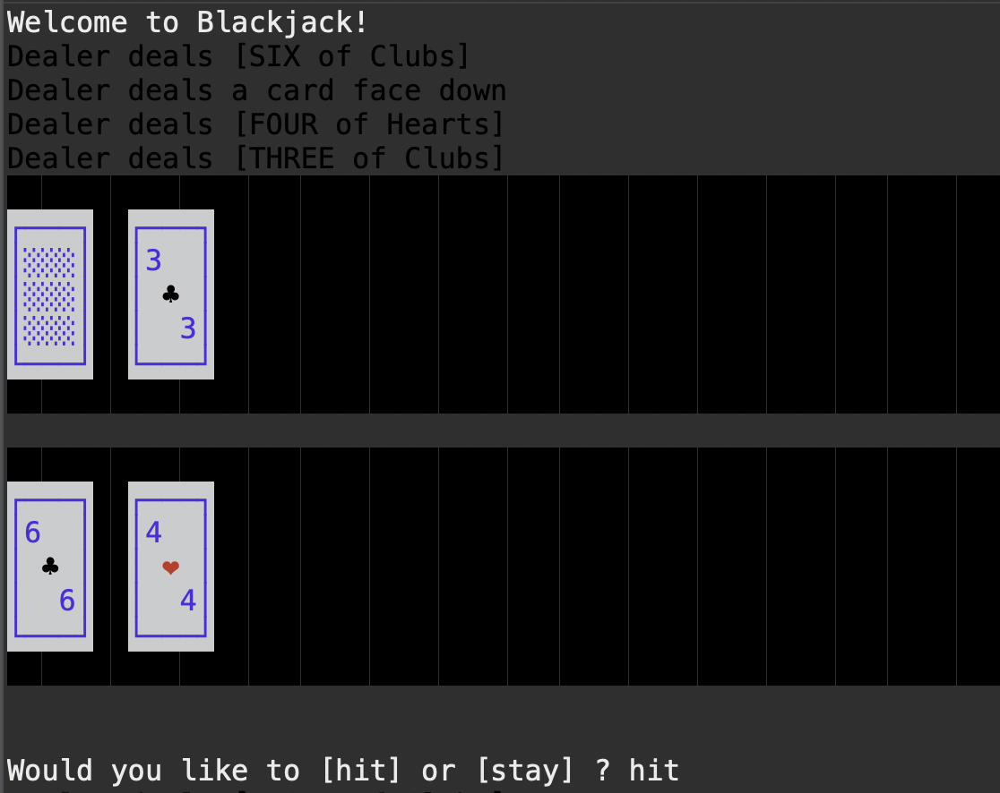
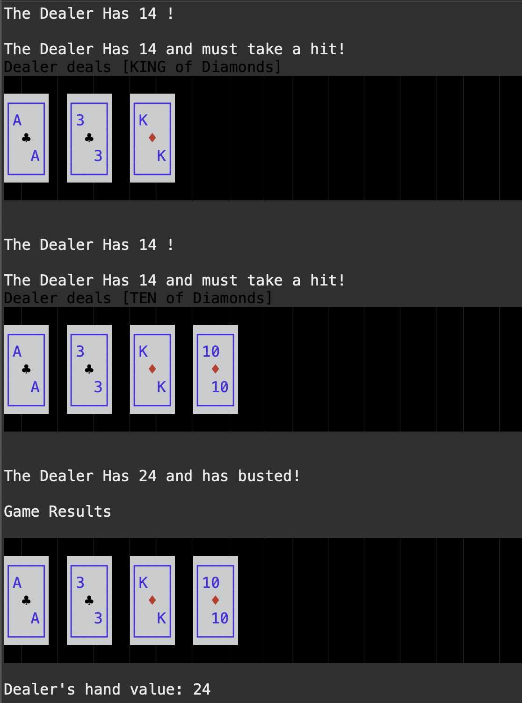
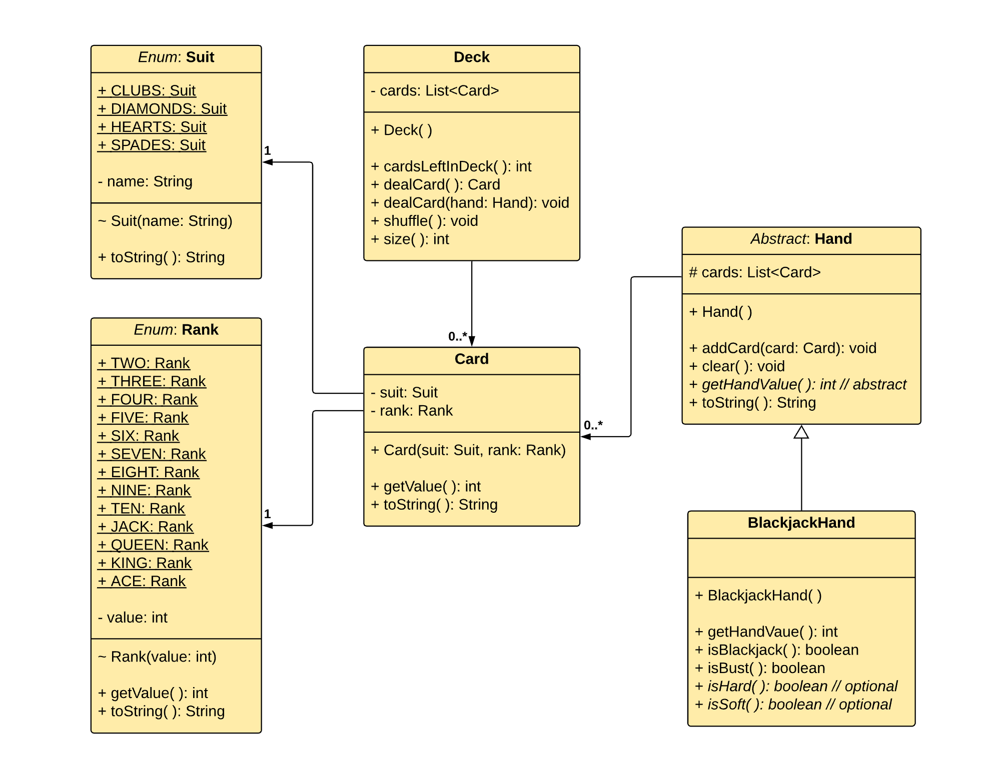

# BlackjackProject

#### Description

- This is the 4th week homework assignment for Skill Distillery, Full Stack Development.


- Use classes to create a working command line blackjack game.

#### Technologies Used
	- JAVA
	- Eclipse
	- Git/GitHub
	- Sublime Text Editor
	- Zsh

#### Lessons Learned
    - Attention to detail, read and re-read requirements.
	- Commit early, commit often, and push!
	- Format code, keep it separated (Indented).
	

#### Display enhancement for user experience.

- Rather than just displaying text versions of cards, I implemented a very involved console window (System.out) class that can be used to generate text in row,column positions that will show text with background and foreground colors. This enabled a nice display of the cards for a surprising console application user experience.


- This screen shot example demonstrations the initial deal.  Note that the cards are delt to the Player, then the Dealer, then the Player, and finally to the dealer.  The dealer's first card is dealt face-down.



- This screen shot demonstrates the smart Ace counting implementation, also known as soft/hard 17. 



#### Sleeper thread for user Interaction and Simulation experience.

-Implementing a sleeper thread to simulate gameplay was beneficial to actually simulate gameplay.

	
```JAVA

	private void sleepFor(int milliseconds) {
		try {
			Thread.sleep(milliseconds);
		} catch (InterruptedException e) {
			e.printStackTrace();
		}
	}
	
```
	
# Partial starting UML that helps demonstrate the start of the project


	
	